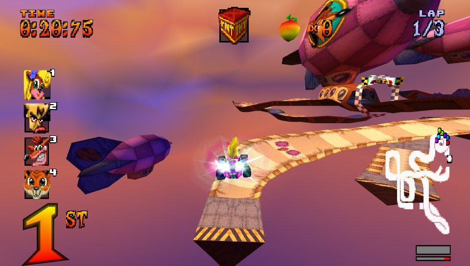

# Crash Team Racing: High Octane
</img> 
Crash Team Racing: High Octane is a sourceport for PSVita and PC (Windows) of Crash Team Racing based on the [ctr-native](https://github.com/CTR-tools/ctr-native) project.
It focuses on new features, enhancements and optimization.

## Features

- True widescreen with no stretching.
- Internal resolution of the renderer bumped to 960x544.
- MSAA 4x (PSVita) / FXAA (PC) for anti-aliasing.
- 60 FPS support.
- Penta Penguin has its stats set to its PAL/NTSC-J counterpart (6/6/6).
- Playable Nitrous Oxide (Unlockable via the original Spyro 2 Demo cheatcode). (Credits: [Original mod](https://github.com/CTR-tools/CTR-ModSDK/tree/main/mods/Modules/OxideFix))
- Reserves Meter (Credits: [Original mod](https://github.com/CTR-tools/CTR-ModSDK/tree/main/mods/Modules/ReservesMeter))
- Customizable Cups (Credits: [Original mod](https://github.com/CTR-tools/CTR-ModSDK/tree/main/mods/Modules/CustomCups))
- Multilanguage support with (optional) PAL voiceovers support (Check "How to use PAL voiceovers").
- Super and Ultra Hard Difficulty modes for Arcade mode.
- USF will show as blue fire (similar to CTR: Nitro Fueled). (Credits: [Original mod](https://github.com/CTR-tools/CTR-ModSDK/tree/main/mods/Modules/BlueFire))
- Super turbopads are cyan to distinguish them from regular turbopads.
- Mirror mode option: Play any track specular.
- Boss Fight option: Challenge Adventure mode bossfights on any track.
- [PSVITA Only] AdHoc Netplay support for two PSVitas multiplayer without the need of a router.
- Several vanilla game bugfixes (eg: PVS related glitches and Penta-Penguin wrong mask powerup HUD icon).
- Ghost Replay feature: Replay all your ghost datas as if you're seeing the run being played live with inputs viewer overlay.
- Increased ghost data limits: No more 7 ghosts globally, now there are 7 ghosts data slot per track.
- Stats viewer for characters in the character selection screen.
- Online leaderboard for Time Trials and Relic Race results.
- Splitscreen support for up to 4 players local multiplayer for PC and PSTV users or PSVita users with MiniVitaTV.
- [PC Only] Discord Rich Presence support when playing with Discord opened.
- Reverse tracks mode for Crash Cove, Roo's Tubes, Tiger Temple, Coco Park, Dragon Mines, Tiny Arena, Slide Coliseum and Turbo Track available in Time Trial and Relic Race mode.
- Relic Race mode available outside of Adventure mode and accessible with any character.
- Relic Race mode now has ghosts support.

## Online leaderboard

The full online leaderboard for Time Trails is available at this link: <a href="https://www.rinnegatamante.eu/ctr/leaderboard/">Online Leaderboard</a>.

## Known Issues

- The demo cutscene gets slightly de-synced during Oxide speech.

## Special controls bindings

- [PSVITA Only] L2 and R2 are also mapped on right analog left/right to let PSVita use those controls.
- [PC Only] F11 is a shortcut to swap between Windowed and Fullscreen Borderless mode.

## How to Install (PSVita)

- Install the .vpk.
- Dump your US copy of `Crash Team Racing` for PS1 and place the bin file in `ux0:data/ctr/assets` named as `ctr-u.bin`.

# How to Install (PC)

- Dump your US copy of `Crash Team Racing` for PS1 and place the bin file in the `assets` folder named as `ctr-u.bin`.

## How to use PAL voiceovers

- Install Python 3.11 or higher ([https://www.python.org/downloads/](https://www.python.org/downloads/)).
- Download [this script](https://github.com/Rinnegatamante/Crash-Team-Racing-High-Octane/raw/refs/heads/vita/tools/extract_pal_voices.py) by right-clicking the link and selecting "Save link as..." or, if the script opens in the browser, "Save page as...".
- Place your PAL Crash Team Racing `.bin` dump in the same folder as the script.
- Open a command prompt in that folder by typing `cmd` in the File Explorer address bar and pressing Enter.
- Run `python extract_pal_voices.py YOUR_DUMP_NAME.bin`.
- When extraction is complete, place the generated `pal-voices` folder:
  - on PSVita: in `ux0:data/ctr/mods/`.
  - on PC: in the `mods` folder next to the CTR: High Octane executable, so that the final path is `mods/pal-voices`.

## How to set up Online functionalities on PC

In order to be able to auto submit your new records in Time Trial and Relic Race modes on PC, you need to set up an account first.
- Navigate to https://www.rinnegatamante.eu/ctr/account/ and create an account.
- Follow the instructions on screen to properly set up the connection on your PC setup.

## How to link PSVita and PC online accounts

- Navigate to https://www.rinnegatamante.eu/ctr/account/ and create an account.
- Follow the instructions on screen to properly link your PC account and your PSVita one.

## Changelog

### v.1.3

- Added a Vita overlay when watching ghosts in Ghost Replay that will show the inputs the player used in realtime.
- Fixed several animations playing at doubled speed when playing at 60 FPS.
- Fixed several sounds playing on both clients when they should be local during AdHoc netplay.
- Fixed "Final Lap" text not showing when playing in AdHoc.
- Fixed the Uka-Uka/Aku-Aku powerup causing constant desyncs resulting in heavy stutter during AdHoc netplay.
- Added "Vs" mode support to AdHoc netplay.
- Added support for PAL voiceovers (English, Italian, Spanish, German and Dutch) (Check the "How to use PAL voiceovers" in the README in order to set it up).
- Added possibility to play Relic Race gamemode outside of Adventure mode. (Available in the Time Trial submenu)
- Added ghosts support to Relic Race gamemode, including Ghost Replay support.
- Made so that super turbopads are now cyan to distinguish them from regular turbopads.
- Integrated Relic Mode into the Online Leaderboard system.
- Added Reverse variants for Crash Cove, Roo's Tubes, Tiger Temple, Coco Park, Dragon Mines, Tiny Arena, Slide Coliseum and Turbo Track. These are available in Time Trial and Relic Race.
- Created a PC port (Windows) of CTR: High Octane. It features everything available on the PSVita variant except for AdHoc mode. Has FXAA, Borderless window mode and Discord Rich Presence support. (In order to be able to compete with the Online Leaderboard, check the "How to set up Online functionalities on PC" in the README).
- Added possibility to link PSVita and PC online accounts for the Online Leaderboard (Check the "How to link PSVita and PC online accounts" section in the README).

### v.1.2

- Fixed N. Oxide portrait slideing in/out from the left instead of from the bottom in the Character Select screen.
- Fixed a bug causing big black glitched textures to show on screen under certain circumstances during singleplayer races.
- Optimized audio mixing and input handling code.
- Rewrote the whole renderer: now it's extremely closer to PSVita GPU architecture. (Average GPU workload per frame went from 31ms to 16ms)
- Rewrote renderer pipeline so that now works in a multi-threaded fashion (backend/frontend approach). This reduces overall CPU workload per frame from 22 ms to 13ms.
- Added 60 FPS support. (Available in the Options menu)
- Added support for multiple controllers on PSTV and PSVita with MiniVitaTV, allowing for local splitscreen games (up to 4 players).
- Made so that Sewer Speedway and Blizzard Bluffs environmental hazards are now deterministic. This also fixes broken ghosts on these specific tracks.
- Added an Online Leaderboard for Time Trial results. Your best scores will automatically be uploaded to it and you can watch ghosts of the top 5 scores worldwide.
- Fixed two different bugs both causing some tiles to be incorrectly clipped under certain circumstances.
- Made so that when an AdHoc connection is interrupted, the console will automatically return in Internet mode.
- Fixed a bug causing missiles used by enemy AIs to not be homing and instead always proceeding in a straight line.

### v.1.1

- Made so that the ghosts aren't limited anymore to 7 globally. You can now have 7 ghosts per track.
- Added a Ghost Replay feature that allows you to replay ghost data as if the race is running in single person. (Available only for ghost data generated from v.1.1 or higher)
- Refactored the main menu with submenus so that it's easier to navigate.
- Added a stats viewer in the character selection screen when playing in single player.
- Added Boss Fight mode. This mode allows you to play against the bosses from Adventure mode on any track.
- Optimized GPU workload by optimizing all the various shader variants used by the renderer: this improves overall framerate.
- Added AdHoc netplay: currently limited only to Arcade - Single Track mode, this allows for router-less 2 Vitas netplay.
- Optimized the missiles powerup rendering effect. Now there won't be anymore framedrops when missiles are on screen.
- Fixed a bug in vanilla game that was causing Penta Penguin powerup HUD to show Uka-Uka instead of Aku-Aku.
- Fixed a bug causing the Uka-Uka/Aku-Aku powerup to occasionally enter in stale setups, resulting in audio glitches (eg: powerup music playing permanently or playing when you were recovered from an out of track).
- Added ability to skip the intro from the very first frame of the SCEA copyright screen by pressing START.

## vitaGL flags for compilation

`HAVE_SHADER_CACHE=1 NO_DEBUG=1 READBACKS_SPEEDHACK=1 CIRCULAR_POOL_SPEEDHACK=1`

## Credits

- Standard-Republic for the Livearea assets.
- robin994 for helping testing splitscreen implementation.
- All the folks involved in ctr-native and the decompilation efforts of CTR.
